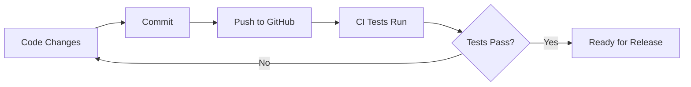
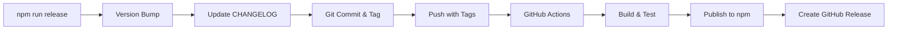

# 🚀 Publishing & Release Guide

## Issues Fixed

### ❌ Problems We Had
1. **Old tags** (0.7.6, 0.7.7) from previous repo - **FIXED** ✅
2. **Line ending warnings** (LF vs CRLF) - **FIXED** ✅
3. **Node.js deprecation warning** (fs.F_OK) - Will be fixed in standard-version update
4. **GitHub packages registry** - Changed to public npm ✅
5. **No automation** - Added GitHub Actions ✅

### ✅ What Was Fixed

1. **Deleted Old Tags**
   ```bash
   # Deleted locally and from GitHub
   - 0.7.6 (from old localbase repo)
   - 0.7.7 (from old localbase repo)
   - 0.0.1 (old version)
   ```

2. **Added .gitattributes**
   - Forces LF line endings for all text files
   - No more CRLF warnings on Windows

3. **Changed npm Registry**
   - From: GitHub Packages (private)
   - To: Public npm registry

4. **Added GitHub Actions**
   - Automated publishing on tag push
   - Manual release workflow
   - Automated testing & building

---

## 🎯 Current Status

**Current Version:** v0.0.3  
**Tags in Repo:** v0.0.3 only  
**Registry:** Public npm (npmjs.com)  
**Automation:** GitHub Actions ready

---

## 📦 Publishing to npm

### First Time Setup

1. **Create npm account** (if you don't have one)
   ```bash
   # Visit: https://www.npmjs.com/signup
   ```

2. **Login to npm**
   ```bash
   npm login
   # Enter your npm username, password, and email
   ```

3. **Verify login**
   ```bash
   npm whoami
   # Should show your npm username
   ```

4. **Add npm token to GitHub**
   - Go to: https://www.npmjs.com/settings/YOUR_USERNAME/tokens
   - Click "Generate New Token" → "Classic Token"
   - Select "Automation" type
   - Copy the token
   - Go to: https://github.com/otabekoff/ombor/settings/secrets/actions
   - Click "New repository secret"
   - Name: `NPM_TOKEN`
   - Value: (paste your token)
   - Click "Add secret"

---

## 🔄 Release Workflow

### Option 1: Local Release (Current Method)

```bash
# 1. Make your changes and commit
git add .
git commit -m "feat: add new feature"

# 2. Create a release (automatically updates version, changelog, and tags)
npm run release              # Patch: 0.0.3 → 0.0.4
npm run release:minor        # Minor: 0.0.3 → 0.1.0
npm run release:major        # Major: 0.0.3 → 1.0.0

# 3. Push with tags
git push --follow-tags origin main

# 4. Publish to npm (manual for now)
npm publish --access public
```

### Option 2: Automated Release (Recommended)

**After setting up npm token:**

```bash
# 1. Make changes and commit
git add .
git commit -m "feat: add new feature"
git push origin main

# 2. Create release locally
npm run release

# 3. Push with tags
git push --follow-tags origin main
```

**GitHub Actions will automatically:**
- ✅ Run tests
- ✅ Run linting
- ✅ Build the package
- ✅ Publish to npm
- ✅ Create GitHub release

### Option 3: GitHub UI Release (Future)

**Once you have npm token set up:**

1. Go to: https://github.com/otabekoff/ombor/actions
2. Click "Release" workflow
3. Click "Run workflow"
4. Select release type (patch/minor/major)
5. Click "Run workflow"

GitHub will handle everything automatically!

---

## 📋 Commit Message Convention

Use conventional commits for automatic changelog generation:

```bash
# Features
git commit -m "feat: add pagination support"
git commit -m "feat(api): add query operators"

# Bug Fixes
git commit -m "fix: resolve memory leak"
git commit -m "fix(build): correct bundling issue"

# Documentation
git commit -m "docs: update API examples"
git commit -m "docs(readme): add installation guide"

# Performance
git commit -m "perf: optimize query execution"

# Refactoring
git commit -m "refactor: simplify collection logic"

# Tests
git commit -m "test: add unit tests for add method"

# Chores
git commit -m "chore: update dependencies"
git commit -m "chore(deps): bump vite to 7.1.8"

# Breaking Changes (triggers major version)
git commit -m "feat!: change API signature"
# OR
git commit -m "feat: change API signature

BREAKING CHANGE: The add() method now returns a Promise<void> instead of Promise<string>"
```

---

## 🎨 Version Bumping Rules

| Commit Type | Version Change | Example |
|-------------|----------------|---------|
| `fix:` | Patch | 0.0.3 → 0.0.4 |
| `feat:` | Minor | 0.0.3 → 0.1.0 |
| `BREAKING CHANGE:` | Major | 0.0.3 → 1.0.0 |
| `chore:`, `docs:`, `refactor:` | None | No version change |

---

## 🔍 Verifying Your Package

After publishing:

```bash
# Check on npm
npm view ombor

# Install in a test project
mkdir test-ombor
cd test-ombor
npm init -y
npm install ombor

# Test it
node -e "const Ombor = require('ombor'); console.log(Ombor)"
```

---

## 🚨 Troubleshooting

### Issue: "You do not have permission to publish"
**Solution:** Make sure you're logged into npm and the package name is available
```bash
npm login
npm whoami
npm search ombor  # Check if name is taken
```

### Issue: "Package already exists"
**Solution:** Change package name in package.json or claim it if it's yours
```bash
npm unpublish ombor@0.0.3 --force  # Only if you own it
```

### Issue: "GitHub Actions failing"
**Solution:** Check that NPM_TOKEN is set in repository secrets
```bash
# Go to: https://github.com/otabekoff/ombor/settings/secrets/actions
# Verify NPM_TOKEN exists
```

### Issue: Line ending warnings
**Solution:** Already fixed with .gitattributes, but you can normalize:
```bash
git add --renormalize .
git commit -m "chore: normalize line endings"
```

### Issue: Old tags showing up
**Solution:** Already cleaned up, but if needed:
```bash
# Delete local tag
git tag -d TAG_NAME

# Delete remote tag
git push origin --delete TAG_NAME
```

---

## 📚 Workflow Summary

### Development Cycle


### Release Cycle


---

## ✅ Quick Checklist

Before releasing:
- [ ] All tests pass (`npm test`)
- [ ] No linting errors (`npm run lint`)
- [ ] No type errors (`npm run type-check`)
- [ ] Build works (`npm run build`)
- [ ] Commits follow convention
- [ ] README is updated
- [ ] Breaking changes documented

---

## 🎯 Next Steps

1. **Set up npm account and token** (if not done)
2. **Add NPM_TOKEN to GitHub secrets**
3. **Test the automated workflow:**
   ```bash
   # Make a small change
   echo "// Test" >> src/index.ts
   git add .
   git commit -m "chore: test automated release"
   git push origin main
   
   # Create release
   npm run release
   git push --follow-tags origin main
   
   # Watch GitHub Actions run!
   ```

4. **Verify on npm:**
   - Visit: https://www.npmjs.com/package/ombor
   - Should see your package published!

---

## 📖 Resources

- **npm Documentation:** https://docs.npmjs.com/
- **Conventional Commits:** https://www.conventionalcommits.org/
- **standard-version:** https://github.com/conventional-changelog/standard-version
- **GitHub Actions:** https://docs.github.com/en/actions
- **Semantic Versioning:** https://semver.org/

---

**Your package is now ready for automated publishing!** 🎉

Once you set up the npm token, every time you push a tag, GitHub will automatically:
1. Run all tests
2. Build the package
3. Publish to npm
4. Create a GitHub release

**No more manual steps!** 🚀
